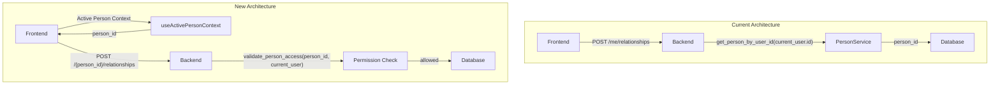

# Design Document: Person Context API Refactor

## Overview

This refactoring changes the person-related APIs from deriving `person_id` from the session to accepting it as an explicit parameter. The frontend will maintain an "Active Person Context" that holds the current person ID, initially set to the user's Primary Person on login.

This is a foundational change that enables future features like "Assume Person Role" without requiring additional API changes.

## Architecture



## Components and Interfaces

### Backend Components

#### 1. Permission Validation Utility

New utility function for consistent permission checking across all endpoints.

```python
# app/utils/person_permissions.py

from uuid import UUID
from fastapi import HTTPException
from app.db_models.user import User
from app.db_models.person.person import Person

def validate_person_access(
    person: Person | None,
    current_user: User,
    allow_created_by: bool = True,
) -> Person:
    """
    Validate that the current user has permission to access/modify a person.
    
    Args:
        person: The person to validate access for (or None if not found)
        current_user: The currently authenticated user
        allow_created_by: Whether to allow access if user created the person
        
    Returns:
        The person if access is allowed
        
    Raises:
        HTTPException: 404 if person not found, 403 if access denied
    """
    if not person:
        raise HTTPException(status_code=404, detail="Person not found")
    
    # Check if user owns this person (their primary person)
    if person.user_id == current_user.id:
        return person
    
    # Check if user created this person
    if allow_created_by and person.created_by_user_id == current_user.id:
        return person
    
    # Check if user is admin
    if current_user.is_admin:
        return person
    
    raise HTTPException(
        status_code=403,
        detail="Not authorized to access this person"
    )
```

#### 2. New Person-Specific Endpoints

Add new endpoints that accept `person_id` as a path parameter.

```python
# app/api/routes/person/person.py

# Relationships
@router.post("/{person_id}/relationships", response_model=PersonRelationshipPublic)
def create_person_relationship(
    session: SessionDep,
    current_user: CurrentUser,
    person_id: uuid.UUID,
    relationship_in: PersonRelationshipCreate,
) -> Any:
    """Create relationship for a specific person."""
    person_service = PersonService(session)
    person = person_service.person_repo.get_by_id(person_id)
    validate_person_access(person, current_user)
    
    relationship_service = PersonRelationshipService(session)
    return relationship_service.create_relationship(person_id, relationship_in)

@router.get("/{person_id}/relationships", response_model=list[PersonRelationshipPublic])
def get_person_relationships(
    session: SessionDep,
    current_user: CurrentUser,
    person_id: uuid.UUID,
) -> Any:
    """Get all relationships for a specific person."""
    person_service = PersonService(session)
    person = person_service.person_repo.get_by_id(person_id)
    validate_person_access(person, current_user)
    
    relationship_service = PersonRelationshipService(session)
    return relationship_service.get_relationships_by_person(person_id)

# Addresses
@router.get("/{person_id}/addresses", response_model=list[PersonAddressPublic])
def get_person_addresses(
    session: SessionDep,
    current_user: CurrentUser,
    person_id: uuid.UUID,
) -> Any:
    """Get all addresses for a specific person."""
    person_service = PersonService(session)
    person = person_service.person_repo.get_by_id(person_id)
    validate_person_access(person, current_user)
    
    address_service = PersonAddressService(session)
    return address_service.get_addresses_by_person(person_id)

# Similar pattern for professions, metadata, etc.
```

#### 3. Refactored /me Endpoints

Keep `/me` endpoints as thin wrappers that resolve to the user's primary person.

```python
# app/api/routes/person/person.py

@router.get("/me/relationships", response_model=list[PersonRelationshipPublic])
def get_my_relationships(session: SessionDep, current_user: CurrentUser) -> Any:
    """Get relationships for current user's primary person."""
    person_service = PersonService(session)
    person = person_service.get_person_by_user_id(current_user.id)
    if not person:
        raise HTTPException(status_code=404, detail="Person profile not found")
    
    # Delegate to the person-specific endpoint logic
    relationship_service = PersonRelationshipService(session)
    return relationship_service.get_relationships_by_person(person.id)
```

### Frontend Components

#### 1. Active Person Context Provider

```typescript
// src/contexts/ActivePersonContext.tsx

import { createContext, useContext, useState, useEffect, ReactNode } from "react"
import { useQuery } from "@tanstack/react-query"
import { PersonService, type PersonPublic } from "@/client"

interface ActivePersonContextType {
  activePerson: PersonPublic | null
  activePersonId: string | null
  isLoading: boolean
  error: Error | null
}

const ActivePersonContext = createContext<ActivePersonContextType | undefined>(undefined)

export function ActivePersonProvider({ children }: { children: ReactNode }) {
  // Fetch the user's primary person on mount
  const { data: primaryPerson, isLoading, error } = useQuery({
    queryKey: ["myPerson"],
    queryFn: () => PersonService.getMyPerson(),
  })

  const value: ActivePersonContextType = {
    activePerson: primaryPerson ?? null,
    activePersonId: primaryPerson?.id ?? null,
    isLoading,
    error: error as Error | null,
  }

  return (
    <ActivePersonContext.Provider value={value}>
      {children}
    </ActivePersonContext.Provider>
  )
}

export function useActivePersonContext(): ActivePersonContextType {
  const context = useContext(ActivePersonContext)
  if (context === undefined) {
    throw new Error("useActivePersonContext must be used within ActivePersonProvider")
  }
  return context
}
```

#### 2. Updated API Calls

```typescript
// Example: Updated AddFamilyMemberDialog.tsx

import { useActivePersonContext } from "@/contexts/ActivePersonContext"

export function AddFamilyMemberDialog({ ... }) {
  const { activePersonId } = useActivePersonContext()
  
  const createRelationshipMutation = useMutation({
    mutationFn: (data: { relatedPersonId: string; relationshipType: string }) =>
      PersonService.createPersonRelationship({
        personId: activePersonId!, // Use active person context
        requestBody: {
          related_person_id: data.relatedPersonId,
          relationship_type: data.relationshipType,
          is_active: true,
        },
      }),
    // ...
  })
}
```

#### 3. Updated useFamilyTreeData Hook

```typescript
// src/hooks/useFamilyTreeData.ts

export function useFamilyTreeData(personId: string | null) {
  const query = useQuery({
    queryKey: ["familyTreeData", personId],
    queryFn: async () => {
      if (!personId) throw new Error("Person ID required")
      
      // Always use the person-specific endpoint
      const response = await PersonService.getPersonRelationshipsWithDetails({ 
        personId 
      })
      
      // ... rest of the logic
    },
    enabled: personId !== null,
  })
  
  return { ... }
}
```

## Data Models

### API Request/Response Changes

No changes to data models - only the endpoint paths change.

**Before:**
```
POST /api/v1/person/me/relationships
Body: { related_person_id, relationship_type, ... }
```

**After:**
```
POST /api/v1/persons/{person_id}/relationships
Body: { related_person_id, relationship_type, ... }
```

### Permission Check Response

```python
# For 403 Forbidden responses
{
    "detail": "Not authorized to access this person"
}
```

## Correctness Properties

*A property is a characteristic or behavior that should hold true across all valid executions of a system—essentially, a formal statement about what the system should do. Properties serve as the bridge between human-readable specifications and machine-verifiable correctness guarantees.*

### Property 1: Own Person Access

*For any* user and their Primary_Person, all person-specific API operations on that person SHALL succeed (return 2xx status).

**Validates: Requirements 6.1**

### Property 2: Created Person Access

*For any* user and any Person where `created_by_user_id == user.id`, all person-specific API operations on that person SHALL succeed (return 2xx status).

**Validates: Requirements 6.2**

### Property 3: Unauthorized Access Denial

*For any* user and any Person where `user_id != user.id` AND `created_by_user_id != user.id` AND user is not ADMIN, all person-specific API operations SHALL return 403 Forbidden.

**Validates: Requirements 6.4**

### Property 4: Admin Override

*For any* ADMIN user and any Person, all person-specific API operations SHALL succeed regardless of ownership.

**Validates: Requirements 6.3**

### Property 5: Context Initialization

*For any* user login, the Active_Person_Context SHALL be initialized to the user's Primary_Person ID.

**Validates: Requirements 1.2**

### Property 6: Backward Compatibility

*For any* `/me` endpoint call, the result SHALL be identical to calling the equivalent `/{person_id}` endpoint with the user's Primary_Person ID.

**Validates: Requirements 8.1, 8.2**

### Property 7: Data Integrity

*For any* relationship created via `/{person_id}/relationships`, the relationship's `person_id` field SHALL equal the path parameter `person_id`.

**Validates: Requirements 2.1**

## Error Handling

### Backend Error Responses

| Condition | Status | Response |
|-----------|--------|----------|
| Person not found | 404 | `{"detail": "Person not found"}` |
| Not authorized | 403 | `{"detail": "Not authorized to access this person"}` |
| Invalid UUID format | 422 | `{"detail": "Invalid person ID format"}` |
| Missing required field | 422 | `{"detail": [{"loc": [...], "msg": "...", "type": "..."}]}` |

### Frontend Error Handling

```typescript
// In API calls
try {
  await PersonService.createPersonRelationship({ personId, requestBody })
} catch (error) {
  if (error.status === 403) {
    showErrorToast("You don't have permission to manage this person")
  } else if (error.status === 404) {
    showErrorToast("Person not found")
  } else {
    showErrorToast("An error occurred. Please try again.")
  }
}
```

## Testing Strategy

### Unit Tests

1. **Permission validation utility**
   - Test own person access allowed
   - Test created person access allowed
   - Test admin override works
   - Test unauthorized access denied
   - Test person not found returns 404

2. **API endpoints**
   - Test each new `/{person_id}` endpoint
   - Test `/me` endpoints still work
   - Test error responses

3. **Frontend context**
   - Test context initialization
   - Test context provides correct values
   - Test error handling

### Property-Based Tests

Property tests verify universal properties using Hypothesis (Python) and fast-check (TypeScript).

**Configuration:**
- Minimum 100 iterations per property
- Tag format: `Feature: person-context-api-refactor, Property N: {property_text}`

### Integration Tests

1. **End-to-end flow**
   - Login → Context initialized → Create relationship → Verify data

2. **Permission scenarios**
   - User accessing own person
   - User accessing created person
   - User accessing unauthorized person
   - Admin accessing any person

3. **Backward compatibility**
   - Compare `/me` and `/{person_id}` responses
