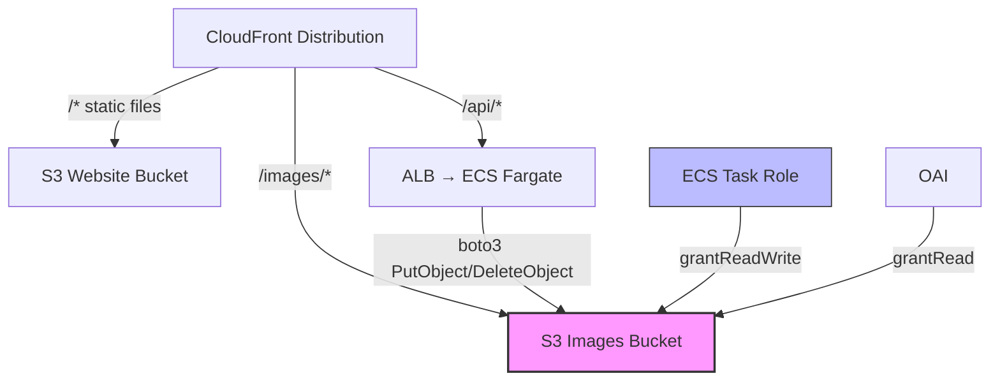

# Design Document: Person Image Infrastructure (CDK)

## Overview

This design adds the AWS infrastructure resources needed to support person profile image storage and CDN-cached delivery in production. It modifies the existing single CDK stack in `infra/lib/fullstack-app.ts` to add an S3 bucket, CloudFront behavior, IAM permissions, and environment variable injection.

The changes are additive — no existing resources are modified or replaced.

## Architecture



The new `/images/*` CloudFront behavior serves images directly from S3 with edge caching. The backend uploads/deletes images via boto3 using the ECS task role. CloudFront reads images via OAI (no public bucket access).

## Components and Interfaces

### S3 Images Bucket

Added to `infra/lib/fullstack-app.ts`:

```typescript
const imagesBucket = new s3.Bucket(this, 'ImagesBucket', {
  blockPublicAccess: s3.BlockPublicAccess.BLOCK_ALL,
  removalPolicy: cdk.RemovalPolicy.RETAIN,
});

// CloudFront OAI can read images
imagesBucket.grantRead(originAccessIdentity);
```

Key decisions:
- `RETAIN` removal policy: prevents accidental image deletion on stack teardown (unlike the website bucket which uses `DESTROY`)
- `BLOCK_ALL` public access: images are only accessible through CloudFront OAI
- No `autoDeleteObjects`: since we're retaining, we don't want auto-delete

### ECS Task Permissions

```typescript
imagesBucket.grantReadWrite(backendService.taskDefinition.taskRole);
```

This grants `s3:GetObject`, `s3:PutObject`, `s3:DeleteObject`, and `s3:ListBucket` on the images bucket to the Fargate task role. The CDK `grantReadWrite` method applies least-privilege scoped to this specific bucket.

### CloudFront Behavior

Added to the `additionalBehaviors` in the existing CloudFront distribution:

```typescript
'/images/*': {
  origin: new origins.S3Origin(imagesBucket, { originAccessIdentity }),
  viewerProtocolPolicy: cloudfront.ViewerProtocolPolicy.REDIRECT_TO_HTTPS,
  cachePolicy: cloudfront.CachePolicy.CACHING_OPTIMIZED,
},
```

Key decisions:
- `CACHING_OPTIMIZED`: images are immutable (UUID-based filenames), so aggressive caching is safe and reduces S3 costs
- No `originRequestPolicy` needed: S3 origin doesn't need forwarded headers
- Path pattern `/images/*`: the S3Storage backend uploads with prefix `person-images/`, so images are at `/images/person-images/{uuid}.jpg`

### Environment Variables

Added after the distribution is created (to avoid circular references):

```typescript
backendService.taskDefinition.defaultContainer!.addEnvironment(
  'S3_IMAGES_BUCKET', imagesBucket.bucketName
);
backendService.taskDefinition.defaultContainer!.addEnvironment(
  'CLOUDFRONT_IMAGES_URL', `https://${distribution.distributionDomainName}/images`
);
```

### CDK Outputs

```typescript
new cdk.CfnOutput(this, 'ImagesBucketName', { value: imagesBucket.bucketName });
new cdk.CfnOutput(this, 'ImagesUrl', { 
  value: `https://${distribution.distributionDomainName}/images` 
});
```

### Frontend Image URL Utility Update

The existing `getPersonImageUrl` utility in `frontend/src/utils/personImage.ts` only supports local URLs. It needs to check for `VITE_IMAGES_URL` to support CloudFront in production:

```typescript
export function getPersonImageUrl(
  profileImageKey: string | null | undefined,
  variant: "main" | "thumbnail" = "thumbnail",
): string | undefined {
  if (!profileImageKey) return undefined

  const key =
    variant === "thumbnail"
      ? profileImageKey.replace(/\.jpg$/, "_thumb.jpg")
      : profileImageKey

  const imagesUrl = import.meta.env.VITE_IMAGES_URL
  if (imagesUrl) {
    return `${imagesUrl}/person-images/${key}`
  }

  const baseUrl = import.meta.env.VITE_API_URL || ""
  return `${baseUrl}/api/v1/uploads/person-images/${key}`
}
```

When `VITE_IMAGES_URL` is set (e.g., `https://d1234.cloudfront.net/images`), images resolve to `https://d1234.cloudfront.net/images/person-images/{uuid}.jpg`. When not set, the existing local pattern is used.

## Data Models

No data model changes — this spec is purely infrastructure.

### S3 Object Key Structure

Images are stored in S3 with this key pattern:
```
person-images/{uuid}.jpg        # Main image (400x400 max)
person-images/{uuid}_thumb.jpg  # Thumbnail (100x100 max)
```

Accessed via CloudFront at:
```
https://{distribution}.cloudfront.net/images/person-images/{uuid}.jpg
https://{distribution}.cloudfront.net/images/person-images/{uuid}_thumb.jpg
```

### Config.json

No changes needed to `infra/config.json` — the images bucket doesn't need configurable sizing like the database or backend.


## Correctness Properties

*A property is a characteristic or behavior that should hold true across all valid executions of a system — essentially, a formal statement about what the system should do. Properties serve as the bridge between human-readable specifications and machine-verifiable correctness guarantees.*

This spec is purely infrastructure (CDK/CloudFormation). All testable acceptance criteria are example-based (CDK template assertions), not property-based. There are no universal properties that apply across a range of inputs — the infrastructure is a fixed configuration.

No testable properties.

## Error Handling

| Scenario | Behavior |
|----------|----------|
| CDK deploy fails due to circular dependency | Ensure env vars are added after distribution creation. CDK will error at synth time if circular. |
| S3 bucket already exists with same name | CDK auto-generates unique names, so this shouldn't happen. If it does, delete the orphaned bucket or change the stack name. |
| OAI permissions not applied | CloudFront will return 403 for image requests. Verify by checking the bucket policy in the AWS console. |
| ECS task can't write to S3 | Backend will return 500 on image upload. Check the task role IAM policy in the AWS console. |

## Testing Strategy

**CDK Snapshot/Assertion Tests** (optional):
- Use `aws-cdk-lib/assertions` to verify the synthesized CloudFormation template
- Assert the images bucket exists with `BlockPublicAccess` and `DeletionPolicy: Retain`
- Assert the CloudFront distribution has a `/images/*` cache behavior
- Assert the ECS task definition includes `S3_IMAGES_BUCKET` and `CLOUDFRONT_IMAGES_URL` env vars
- Assert the stack outputs include `ImagesBucketName` and `ImagesUrl`

**Manual Verification After Deploy**:
1. Run `npx cdk diff` to preview changes before deploying
2. After deploy, verify image upload works: upload via API, then fetch via CloudFront URL
3. Check CloudFront behavior: `curl -I https://{distribution}/images/person-images/test.jpg` should return CloudFront headers
