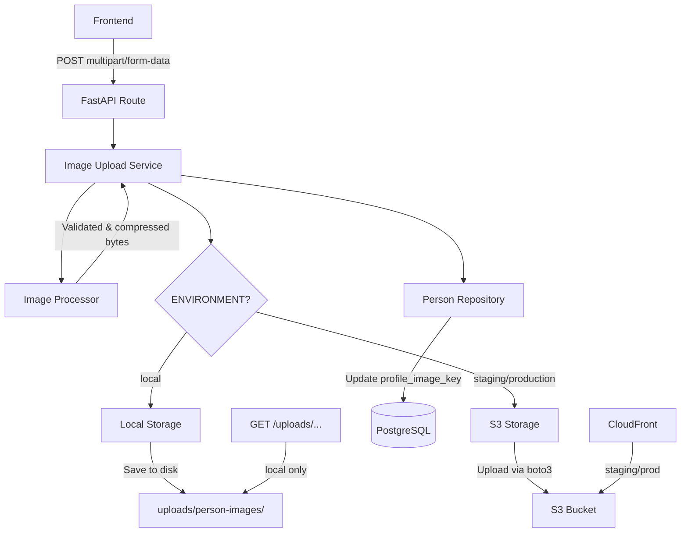

# Design Document: Person Profile Image Backend

## Overview

This design describes the backend infrastructure for person profile image upload, processing, storage, and retrieval. The system follows the existing repository/service pattern in the codebase and introduces a pluggable storage abstraction that switches between local filesystem (development) and AWS S3 (staging/production) based on the `ENVIRONMENT` setting.

The image processing pipeline uses Pillow to validate, resize, compress, and strip metadata from uploaded images, producing two variants: a main image (400x400 max) and a thumbnail (100x100 max), both in JPEG format.

## Architecture



The flow:
1. Frontend sends a multipart file upload to the API endpoint
2. The route handler delegates to `ImageUploadService`
3. `ImageUploadService` calls `ImageProcessor` to validate, resize, and compress
4. `ImageUploadService` calls the appropriate `StorageBackend` to persist the files
5. `ImageUploadService` updates the `Person` record with the image key via the existing `PersonService`

## Components and Interfaces

### StorageBackend (Abstract Base Class)

Location: `backend/app/services/storage/base.py`

```python
from abc import ABC, abstractmethod

class StorageBackend(ABC):
    @abstractmethod
    def upload(self, file_data: bytes, filename: str) -> str:
        """Upload file and return the storage key."""
        ...

    @abstractmethod
    def delete(self, filename: str) -> None:
        """Delete a file by its storage key."""
        ...

    @abstractmethod
    def get_url(self, filename: str) -> str:
        """Get the public URL for a stored file."""
        ...
```

### LocalStorage

Location: `backend/app/services/storage/local_storage.py`

- Saves files to `uploads/person-images/` directory
- Creates the directory if it doesn't exist
- Returns URLs in the format `/api/v1/uploads/person-images/{filename}`
- Deletes files from disk on `delete()`

### S3Storage

Location: `backend/app/services/storage/s3_storage.py`

- Uses `boto3` to upload files to the configured S3 bucket under the `person-images/` prefix
- Sets `ContentType: image/jpeg` on upload
- Returns CloudFront URL if `CLOUDFRONT_IMAGES_URL` is configured, otherwise falls back to S3 URL
- Deletes objects from S3 on `delete()`

### StorageBackend Factory

Location: `backend/app/services/storage/__init__.py`

```python
from app.core.config import settings

def get_storage_backend() -> StorageBackend:
    if settings.ENVIRONMENT == "local":
        return LocalStorage(upload_dir="uploads/person-images")
    else:
        return S3Storage(
            bucket=settings.S3_IMAGES_BUCKET,
            cloudfront_url=settings.CLOUDFRONT_IMAGES_URL,
        )
```

### ImageProcessor

Location: `backend/app/services/image_processor.py`

Responsibilities:
- Validate file type (JPEG, PNG, WebP) by reading the image header with Pillow
- Validate file size against `IMAGE_MAX_SIZE_MB`
- Resize to fit within `IMAGE_MAX_DIMENSION` x `IMAGE_MAX_DIMENSION` (main) and `IMAGE_THUMBNAIL_DIMENSION` x `IMAGE_THUMBNAIL_DIMENSION` (thumbnail), preserving aspect ratio using `Image.thumbnail()`
- Convert to RGB mode (handles RGBA PNGs)
- Save as JPEG at `IMAGE_QUALITY` quality
- Strip EXIF by not copying metadata to the output

```python
class ImageProcessor:
    def __init__(self, max_dimension: int, thumbnail_dimension: int, quality: int):
        ...

    def validate(self, file_data: bytes) -> None:
        """Raises ValueError if file is not a valid image or exceeds size limits."""
        ...

    def process(self, file_data: bytes) -> tuple[bytes, bytes]:
        """Returns (main_image_bytes, thumbnail_bytes)."""
        ...
```

### ImageUploadService

Location: `backend/app/services/image_upload_service.py`

Orchestrates the full upload flow:
1. Validate file size
2. Call `ImageProcessor.validate()` and `ImageProcessor.process()`
3. Generate UUID-based filename: `{uuid}.jpg` and `{uuid}_thumb.jpg`
4. Call `StorageBackend.upload()` for both main and thumbnail
5. If person already has an image, call `StorageBackend.delete()` on old files
6. Update `Person.profile_image_key` via the session

```python
class ImageUploadService:
    def __init__(self, session: Session):
        self.storage = get_storage_backend()
        self.processor = ImageProcessor(
            max_dimension=settings.IMAGE_MAX_DIMENSION,
            thumbnail_dimension=settings.IMAGE_THUMBNAIL_DIMENSION,
            quality=settings.IMAGE_QUALITY,
        )

    def upload_profile_image(self, person: Person, file_data: bytes) -> dict:
        """Process and store image, return URLs."""
        ...

    def delete_profile_image(self, person: Person) -> None:
        """Delete image from storage and clear person record."""
        ...

    def get_image_urls(self, person: Person) -> dict | None:
        """Return main and thumbnail URLs, or None if no image."""
        ...
```

### API Routes

Location: `backend/app/api/routes/person/person.py` (added to existing file)

New endpoints:
- `POST /api/v1/persons/me/profile-image` — Upload image for current user's person
- `GET /api/v1/persons/me/profile-image` — Get image URLs for current user's person
- `DELETE /api/v1/persons/me/profile-image` — Delete image for current user's person
- `POST /api/v1/persons/{person_id}/profile-image` — Upload image for a specific person (with access check)
- `GET /api/v1/persons/{person_id}/profile-image` — Get image URLs for a specific person
- `DELETE /api/v1/persons/{person_id}/profile-image` — Delete image for a specific person (with access check)

The upload endpoints accept `multipart/form-data` with a single `file` field using FastAPI's `UploadFile`.

### Static File Serving (Local Only)

In `backend/app/main.py`, conditionally mount static files:

```python
if settings.ENVIRONMENT == "local":
    from fastapi.staticfiles import StaticFiles
    app.mount("/api/v1/uploads", StaticFiles(directory="uploads"), name="uploads")
```

## Data Models

### Person Model Update

Add to `backend/app/db_models/person/person.py`:

```python
profile_image_key: str | None = Field(
    default=None,
    max_length=255,
    description="Storage key for the person's profile image (filename without path)",
)
```

### Alembic Migration

A new migration adds the `profile_image_key` column:

```python
op.add_column('person', sa.Column('profile_image_key', sa.String(255), nullable=True))
```

### Response Schemas

New schema in `backend/app/schemas/person/`:

```python
class PersonImageResponse(BaseModel):
    main_url: str
    thumbnail_url: str

class PersonImageUploadResponse(BaseModel):
    message: str
    main_url: str
    thumbnail_url: str
```

The existing `PersonPublic` schema should also include `profile_image_key` so the frontend can check if a person has an image.

### Configuration Settings Additions

Added to `backend/app/core/config.py` Settings class:

```python
IMAGE_MAX_SIZE_MB: int = 5
IMAGE_MAX_DIMENSION: int = 400
IMAGE_THUMBNAIL_DIMENSION: int = 100
IMAGE_QUALITY: int = 85
S3_IMAGES_BUCKET: str = ""
CLOUDFRONT_IMAGES_URL: str = ""
```

## Correctness Properties

*A property is a characteristic or behavior that should hold true across all valid executions of a system — essentially, a formal statement about what the system should do. Properties serve as the bridge between human-readable specifications and machine-verifiable correctness guarantees.*

### Property 1: LocalStorage round-trip

*For any* byte sequence and valid filename, uploading via LocalStorage and then reading the file from disk should return the exact same bytes.

**Validates: Requirements 1.4**

### Property 2: LocalStorage URL format

*For any* valid filename string, calling `get_url` on LocalStorage should return a string matching the pattern `/api/v1/uploads/person-images/{filename}`.

**Validates: Requirements 1.6**

### Property 3: S3Storage URL format

*For any* valid filename string and configured CloudFront URL, calling `get_url` on S3Storage should return a URL that starts with the CloudFront base URL and ends with the filename.

**Validates: Requirements 1.7**

### Property 4: Image dimension constraints

*For any* valid image (JPEG, PNG, or WebP) of arbitrary dimensions, after processing by ImageProcessor, the main image dimensions should be at most 400x400 and the thumbnail dimensions should be at most 100x100, and both should preserve the original aspect ratio (within 1 pixel tolerance).

**Validates: Requirements 2.1, 2.2**

### Property 5: EXIF metadata stripping

*For any* valid image that contains EXIF metadata, after processing by ImageProcessor, the output image should contain no EXIF metadata.

**Validates: Requirements 2.4**

### Property 6: Invalid file rejection

*For any* byte sequence that is not a valid JPEG, PNG, or WebP image, calling `validate` on ImageProcessor should raise a ValueError.

**Validates: Requirements 2.5**

### Property 7: Image processing produces valid JPEG

*For any* valid image (JPEG, PNG, or WebP), processing it with ImageProcessor and then opening the result with Pillow should produce a valid JPEG image (round-trip property).

**Validates: Requirements 2.3, 2.8**

### Property 8: Image replacement cleans up old files

*For any* person with an existing profile image, uploading a new image should result in the old image files being removed from storage and only the new image files existing.

**Validates: Requirements 3.6**

### Property 9: Unique filename generation

*For any* two calls to the filename generation function, the resulting filenames should be different.

**Validates: Requirements 3.7**

## Error Handling

| Scenario | HTTP Status | Error Message |
|----------|-------------|---------------|
| File not a valid image | 400 | "Invalid image format. Supported formats: JPEG, PNG, WebP" |
| File exceeds size limit | 400 | "Image file size exceeds the maximum allowed size of {max_size} MB" |
| Person not found | 404 | "Person not found" |
| No profile image exists (on GET/DELETE) | 404 | "Person does not have a profile image" |
| Unauthenticated request | 401 | "Not authenticated" (handled by existing auth middleware) |
| Unauthorized access to person | 403 | "Not enough permissions" (handled by existing `validate_person_access`) |
| Storage backend failure | 500 | "Failed to upload image. Please try again." |

All errors follow the existing FastAPI HTTPException pattern used throughout the codebase. Storage errors are caught and logged with full tracebacks before returning a generic 500 to the client.

## Testing Strategy

### Dual Testing Approach

This feature uses both unit tests and property-based tests for comprehensive coverage.

**Unit Tests** (pytest):
- Factory function returns correct storage backend per environment
- API endpoint integration tests (auth, access control, upload/get/delete flows)
- Migration adds column without data loss
- Static file serving conditional on environment
- Configuration defaults

**Property-Based Tests** (Hypothesis):
- The project already uses Hypothesis (`.hypothesis/` directory exists)
- Each correctness property maps to a single Hypothesis test
- Minimum 100 examples per property test
- Custom strategies for generating random valid images (using Pillow to create random-dimension images in JPEG/PNG/WebP)
- Custom strategies for generating random byte sequences (for invalid file testing)
- Each test tagged with: `Feature: person-profile-image-backend, Property {N}: {title}`

**Test File Locations**:
- Unit tests: `backend/tests/services/test_image_upload_service.py`, `backend/tests/services/test_image_processor.py`, `backend/tests/services/storage/test_local_storage.py`
- Property tests: `backend/tests/properties/test_image_properties.py`

**Image Generation Strategy for Property Tests**:
```python
from hypothesis import strategies as st
from PIL import Image
import io

@st.composite
def random_valid_image(draw):
    width = draw(st.integers(min_value=1, max_value=2000))
    height = draw(st.integers(min_value=1, max_value=2000))
    fmt = draw(st.sampled_from(["JPEG", "PNG", "WEBP"]))
    mode = "RGB" if fmt == "JPEG" else draw(st.sampled_from(["RGB", "RGBA"]))
    img = Image.new(mode, (width, height), color=(draw(st.integers(0,255)), draw(st.integers(0,255)), draw(st.integers(0,255))))
    buf = io.BytesIO()
    img.save(buf, format=fmt)
    return buf.getvalue(), width, height, fmt
```

