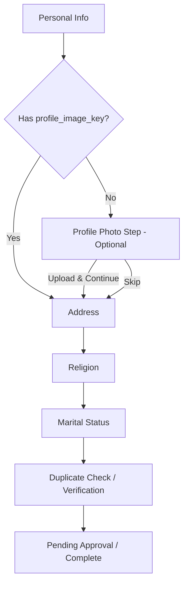

# Design Document: Profile Image Signup Flow

## Overview

This feature adds an optional profile photo upload step to the existing complete-profile flow. The step is inserted between "Marital Status" and "Verification" (duplicate-check). It reuses the existing `ImageUpload` component and the `POST /api/v1/person/me/profile-image` backend endpoint. No backend changes are required.

The core approach:
1. Add a new `"profile-photo"` step to the `ProfileStep` type union
2. Add a `ProfilePhotoStep` component that wraps `ImageUpload` with skip/upload buttons
3. Modify `determineCurrentStep()` to insert the photo step when basic steps are done but the user has no `profile_image_key`
4. Use `PersonService.getMyPerson()` to check for existing profile image (the `profile_image_key` field on `PersonPublic`)

## Architecture

The feature is entirely frontend. The flow modification is minimal:



The step determination logic queries `PersonService.getMyPerson()` to check `profile_image_key`. If the user already has an image (from a previous partial completion or admin action), the step is skipped automatically.

## Components and Interfaces

### Modified Files

1. **`frontend/src/components/Profile/ProgressIndicator.tsx`**
   - Add `"profile-photo"` to the `ProfileStep` type union
   - Add a "Photo" step entry in the steps array between "Marital Status" and "Verification"

2. **`frontend/src/routes/complete-profile.tsx`**
   - Import `ProfilePhotoStep` component
   - Add `PersonService.getMyPerson()` query to check for existing image
   - Modify `determineCurrentStep()` to include `"profile-photo"` step
   - Add rendering logic for the `"profile-photo"` step

3. **New: `frontend/src/components/Profile/ProfilePhotoStep.tsx`**
   - Wraps `ImageUpload` component
   - Handles upload via `fetch()` to `POST /api/v1/person/me/profile-image`
   - Provides "Skip" and "Upload & Continue" buttons
   - Shows loading state during upload
   - Shows error toast on failure

### ProfilePhotoStep Interface

```typescript
interface ProfilePhotoStepProps {
  onComplete: () => void  // Called after successful upload or skip
}
```

### Upload Logic (inside ProfilePhotoStep)

```typescript
async function uploadProfileImage(file: File): Promise<void> {
  const token = localStorage.getItem("access_token")
  const apiBase = import.meta.env.VITE_API_URL || ""
  const formData = new FormData()
  formData.append("file", file)

  const response = await fetch(`${apiBase}/api/v1/person/me/profile-image`, {
    method: "POST",
    headers: { Authorization: `Bearer ${token}` },
    body: formData,
  })

  if (!response.ok) {
    throw new Error("Upload failed")
  }
}
```

This follows the same pattern used in `ConfirmationStep.tsx` for the family wizard image upload.

### Step Determination Logic Change

Current flow in `determineCurrentStep()`:
```
personal-info → address → religion → marital-status → duplicate-check
```

New flow:
```
personal-info → profile-photo → address → religion → marital-status → duplicate-check
```

The `profile-photo` step is shown when:
- The personal-info step is complete (`has_person` is true)
- `has_address` is false (user hasn't moved past this point yet)
- The person's `profile_image_key` is null/undefined

If `profile_image_key` already exists, skip directly to `address`.

The `determineCurrentStep` function will accept an optional `hasProfileImage` boolean parameter derived from the `PersonService.getMyPerson()` query result.

## Data Models

No new data models. Existing models used:

- **`PersonPublic`** (from generated client): Contains `profile_image_key: string | null` — used to determine if user already has a photo.
- **`ProfileCompletionStatus`** (from generated client): Used to determine which basic steps are complete. No changes needed.
- **`ImageUploadProps`** (from `ImageUpload` component): `{ value?: File | null, onChange: (file: File | null) => void, label?: string, maxSizeMB?: number, className?: string }`

The upload endpoint returns `PersonImageUploadResponse` which contains the image URLs, but we don't need to use the response — we just refetch profile status after upload.


## Correctness Properties

*A property is a characteristic or behavior that should hold true across all valid executions of a system — essentially, a formal statement about what the system should do. Properties serve as the bridge between human-readable specifications and machine-verifiable correctness guarantees.*

### Property 1: Step determination respects profile image state

From the prework, criteria 1.1, 5.2, 5.3, and 4.2 all relate to how `determineCurrentStep` behaves based on profile status and image presence. These can be combined into one property:

*For any* profile completion status where `has_person` is true and `has_address` is false, `determineCurrentStep` should return `"profile-photo"` if `hasProfileImage` is false, and `"address"` if `hasProfileImage` is true.

**Validates: Requirements 1.1, 4.2, 5.2, 5.3**

### Property 2: Profile photo step never blocks completion

*For any* profile completion status where `has_address` is true, `determineCurrentStep` should never return `"profile-photo"`, regardless of the `hasProfileImage` value.

**Validates: Requirements 4.2, 5.1**

### Property 3: Step ordering invariant

*For any* profile completion status, the step returned by `determineCurrentStep` should follow the ordering: `personal-info` < `profile-photo` < `address` < `religion` < `marital-status` < `duplicate-check`. That is, if a step N is incomplete, no step after N should be returned.

**Validates: Requirements 1.1, 1.3**

## Error Handling

| Scenario | Handling |
|---|---|
| Upload fetch returns non-200 | Show error toast, keep user on photo step with preview preserved |
| Network error during upload | Catch in try/catch, show error toast, preserve state |
| User has no auth token | Upload will fail with 401, handled by the error path above |
| ImageUpload compression fails | Handled internally by ImageUpload component (shows "Failed to process image") |
| Person record doesn't exist yet | Cannot happen — photo step only shows after `has_person` is true |

The upload failure is non-blocking. The user can retry or skip. This matches the pattern in the family wizard's `ConfirmationStep.tsx` where image upload failure is treated as non-critical.

## Testing Strategy

### Unit Tests
- Test `determineCurrentStep()` with various profile status + `hasProfileImage` combinations
- Test `ProfilePhotoStep` renders correctly (ImageUpload present, buttons present)
- Test button disabled state when no file selected
- Test skip calls `onComplete` without fetch
- Test upload success calls `onComplete`
- Test upload failure shows error and preserves state

### Property-Based Tests
- Use `fast-check` library for property-based testing
- Property 1: Generate random `ProfileCompletionStatus` objects with all basic steps true and `has_duplicate_check` false, vary `hasProfileImage` — verify step determination
- Property 2: Generate random statuses with `has_duplicate_check` true — verify never returns `"profile-photo"`
- Property 3: Generate random statuses — verify ordering invariant holds

### Test Configuration
- Minimum 100 iterations per property test
- Tag format: **Feature: profile-image-signup-flow, Property {N}: {title}**
- Each correctness property implemented as a single `fast-check` property test
